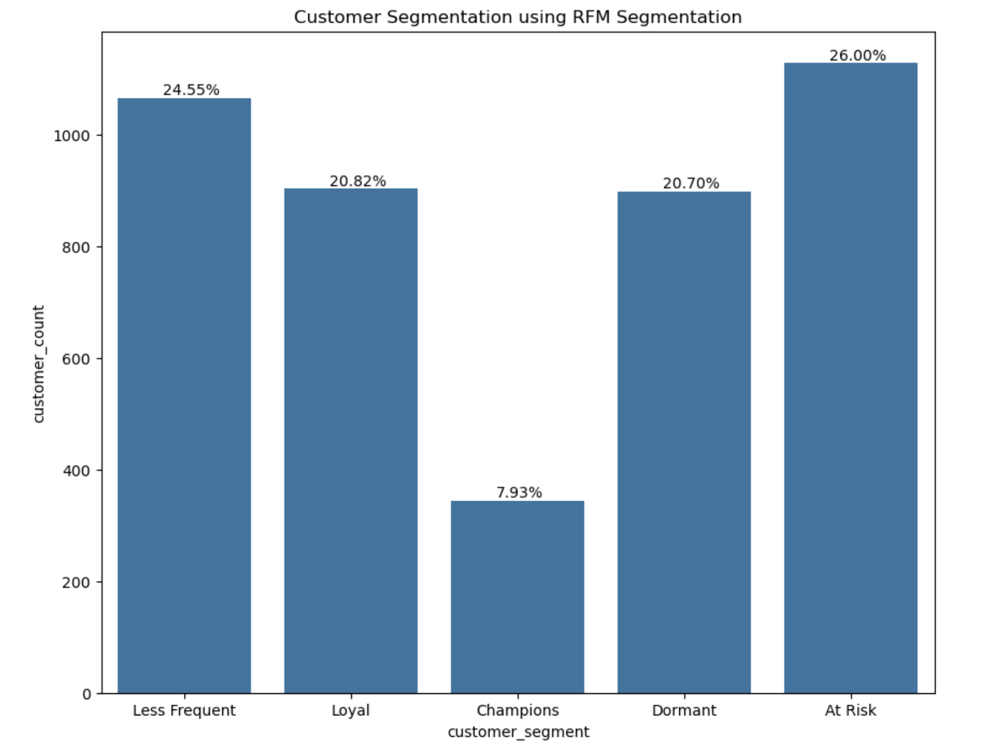
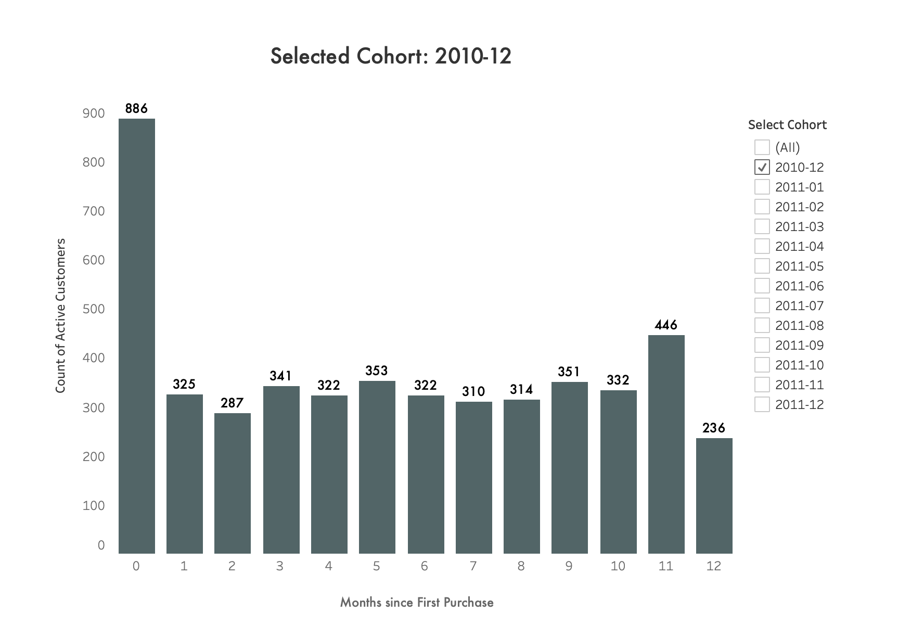

# 🧪 Advanced Analytics: RFM, Cohort & Market Basket

This is where RetailPulse moves from *"what happened"* (EDA) to *"who matters, when do they leave, and what do they buy together."* Three customer-centric techniques are applied on top of the normalized schema to turn 4,373 individual customers into a prioritised, actionable view of the business.

---

## 📁 What's here

| File | Description |
|---|---|
| [`analysis.ipynb`](analysis.ipynb) | The notebook that runs the RFM segmentation and cohort retention queries via `psycopg2`, visualizing both with `matplotlib`/`seaborn` |

> The underlying SQL for all three techniques (RFM, cohort, **and** market basket analysis) lives in **[`sql/analytics.sql`](../sql/analytics.sql)**. This notebook covers RFM and cohort with inline visualization; market basket analysis is run and validated directly in SQL (see [Market Basket Analysis](#-3-market-basket-analysis) below) and features directly in the [case study](<../RetailPulse - Case Study.pdf>) and dashboard.

---

## 🧭 How to proceed

1. Complete the SQL pipeline in [`sql/README.md`](../sql/) first, including `analytics.sql` — this notebook queries the RFM and cohort logic defined there.
2. Open [`analysis.ipynb`](analysis.ipynb) and update the `db_params` dictionary with your local PostgreSQL credentials (same pattern as `EDA/eda.ipynb`).
3. Run all cells top to bottom.
4. To explore market basket pairs directly, run **Section 7** of [`sql/analytics.sql`](../sql/analytics.sql) against your database.

---

## 📊 Documentation & Results

### 1. RFM Segmentation

**Method:** Every customer with at least one completed (non-cancelled, non-anonymous) purchase is scored 1–5 on three dimensions using `NTILE(5)` quintiles:

- **Recency** — days since last purchase (inverted, so a *lower* gap scores *higher*)
- **Frequency** — distinct completed invoices
- **Monetary** — total spend across those invoices

The three scores sum to an overall RFM score (3–15), which maps to five segments:

| Segment | Rule | Definition |
|---|---|---|
| **Champions** | R=5, F=5, M=5 | Most engaged, most frequent, highest spenders |
| **Returning and Loyal** | Overall score ≥ 12 | Consistent repeat buyers |
| **Less Frequent but Loyal** | Overall score ≥ 9 | Infrequent but still engaged |
| **At Risk** | Overall score ≥ 6 | Purchasing less often — an early churn signal |
| **Dormant** | Overall score < 6 | Inactive for an extended period |

**Result:**

| Segment | Customers | % of total |
|---|---|---|
| At Risk | 1,128 | 26.00% |
| Less Frequent | 1,065 | 24.55% |
| Loyal | 903 | 20.82% |
| Dormant | 898 | 20.70% |
| Champions | 344 | 7.93% |

**Reading it:**
- **At Risk is the single largest segment** (26%) — these are customers who have measurably slowed down and are one bad experience away from fully churning. Combined with Dormant, **47.6% of the customer base** needs active win-back attention.
- Only **7.93% of customers are Champions** — the smallest but highest-value group, and the one most worth protecting with VIP treatment rather than generic marketing spend.
- **28.9%** (Champions + Loyal) represent the base already delivering the most value — retention economics strongly favour investing here before chasing new acquisition.

A per-customer version of this scoring (Section 5B of `analytics.sql`) is also available for finer-grained analysis or building a scatter-style visualization of individual customers across the R/F/M space.

---

### 2. Cohort Retention Analysis

**Method:** Every customer is assigned to a monthly acquisition cohort based on their **first completed purchase**. Each subsequent completed order is then tagged with how many months have elapsed since that customer's first purchase (`months_since_first_purchase`), and active customers are counted per cohort per month — the standard building block of a retention curve/heatmap.

**Result (December 2010 cohort, shown below):**

| Month since first purchase | Active customers |
|---|---|
| 0 | 886 |
| 1 | 325 |
| 2 | 287 |
| 3 | 341 |
| 5 | 353 |
| 8 | 314 |
| 11 | 446 |
| 12 | 236 |

**Reading it:**
- The steepest fall happens **immediately** — from 886 active customers at month 0 to 325 by month 1, a drop of nearly **63%** in the very first month.
- Retention partially stabilizes in the 300–350 range for several months afterward, before a **notable rebound at month 11** (446 active customers) — a seasonal promotion effect strong enough to temporarily reverse the churn curve.
- By month 12, only **236 of the original 886 customers (26.6%)** remain active — a **73.4% cumulative churn rate** for this cohort.
- Other cohorts (e.g. January 2011) show even steeper single-month drop-off — as much as ~78% attrition from month 0 to month 1 in some cases.

**Key takeaway:** *Retention is decided far earlier than most win-back programs are designed to act on it. The data shows most cohorts lose over half their base within 2–3 months of the first purchase — the single highest-leverage window for onboarding and early engagement.*

---

### 3. Market Basket Analysis

**Method:** `invoice_items` is self-joined on shared `invoice_no`, with `a.stock_code < b.stock_code` to avoid counting mirrored pairs (A,B)/(B,A) or a product paired with itself. Pairs co-occurring in more than 50 distinct invoices are counted and ranked by frequency (Section 7 of [`sql/analytics.sql`](../sql/analytics.sql)).

**Result — top co-purchased pairs (all exceeding 600 joint purchases):**

| Rank | Pair | Co-occurrence |
|---|---|---|
| 1 | `22386` + `85099B` | 833 |
| 2–5 | `85099B` paired with 3 other bestsellers | 600+ each |
| 6–10 | Sequentially-coded product pairs (e.g. `22697`/`22698`/`22699`, `22726`/`22727`) | 600+ each |

**Reading it:**
- **`85099B` is the anchor product** of this dataset — it appears in **4 of the top 5** most frequently co-purchased pairs, meaning it's effectively pulling multiple other bestsellers along with it. It's worth protecting on stock availability and featuring prominently across related product pages.
- **Sequentially-coded pairs** (products whose stock codes sit right next to each other) show up repeatedly in the top 10 — a strong signal that customers are buying entire **curated collections**, not isolated single items. This points directly at bundling and combo-pricing opportunities rather than single-SKU promotions.

**Turning this into action:**
- **Bundle & upsell** — combo pricing on `85099B` + `22386`; pre-packaged seasonal gift sets built from the strongest pairs.
- **Recommend** — "customers who bought this also bought…" placements on product pages and post-purchase emails.
- **Stock & place** — keep high-affinity pairs co-located in the warehouse and stocked ahead of seasonal peaks to protect fulfilment.

---

## ➡️ Where this leads

These three analyses — segmentation, retention timing, and product affinity — are the direct inputs to the **Strategic Playbook** and **90-day roadmap** laid out in the [master README](../README.md#-strategic-playbook) and detailed fully in **[`RetailPulse - Case Study.pdf`](<../RetailPulse - Case Study.pdf>)**.
