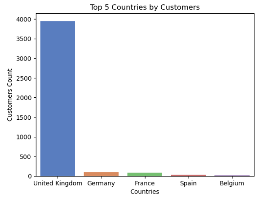
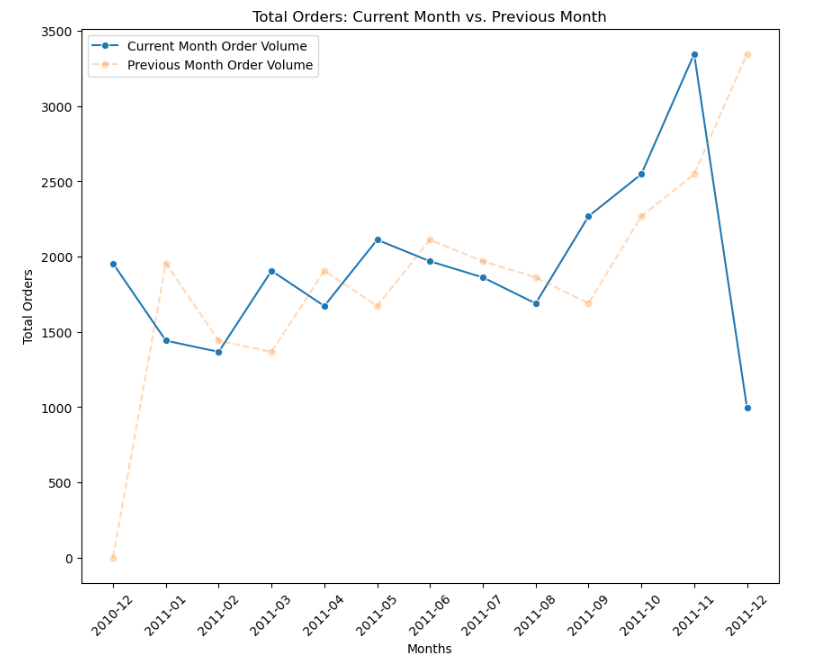
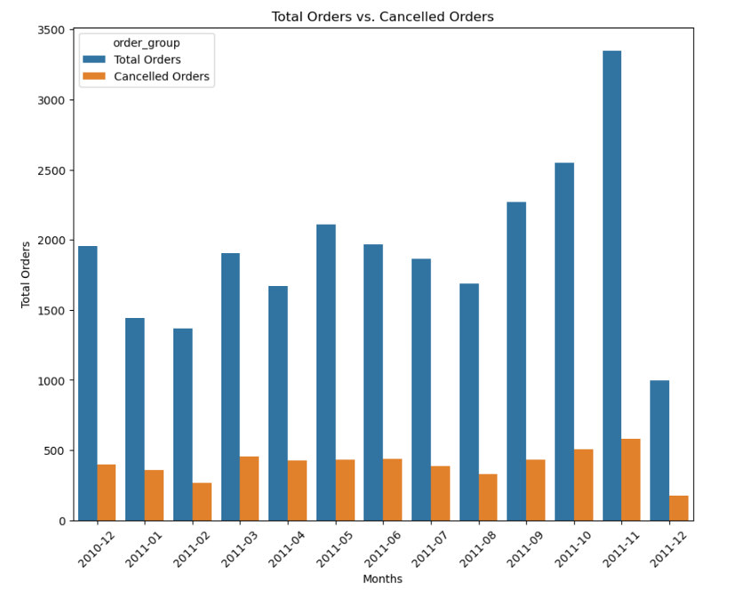
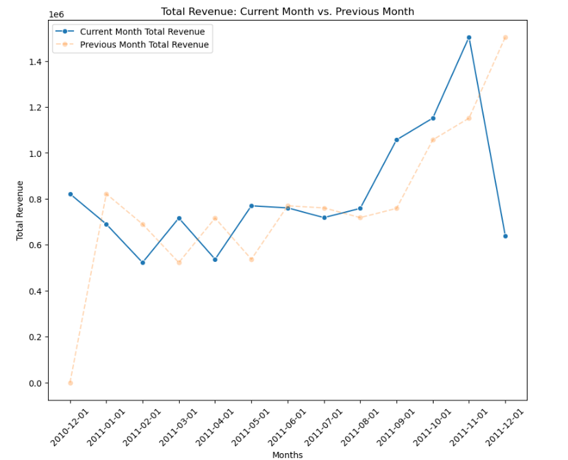

# 🔎 Exploratory Data Analysis (EDA)

Before any segmentation or predictive modelling, this stage answers a simpler question: **what does this business actually look like?** Where do customers sit, how does order and revenue volume move month to month, and how much is cancellation quietly costing?

This folder contains the queries and the notebook used to answer that.

---

## 📁 What's here

| File | Description |
|---|---|
| [`insights.sql`](insights.sql) | The raw SQL behind every finding in this stage — customer, invoice, and product-level queries, each annotated inline with the result and a one-line takeaway |
| [`eda.ipynb`](eda.ipynb) | The Python notebook that runs those same queries via `psycopg2`, loads results into `pandas`, and visualizes them with `matplotlib`/`seaborn` |

> This stage runs **after** the SQL pipeline in [`sql/`](../sql/) — it queries the normalized `customers`, `invoices`, and `invoice_items` tables, so make sure `01`–`03` and `analytics.sql` have already been run.

---

## 🧭 How to proceed

1. Complete the SQL pipeline in [`sql/README.md`](../sql/) first — this notebook depends on the normalized schema.
2. Open [`eda.ipynb`](eda.ipynb) and update the `db_params` dictionary near the top with your local PostgreSQL credentials:
   ```python
   db_params = {
       "dbname": "sikkaretail_db",
       "user": "postgres",   # your username
       "password": "",       # your password
       "host": "localhost",
       "port": 5432
   }
   ```
3. Run all cells top to bottom. Each section connects via `psycopg2`, pulls a query's result into a `pandas.DataFrame`, and plots it.
4. Cross-reference [`insights.sql`](insights.sql) if you want the plain SQL versions of every query without the notebook/plotting overhead.

---

## 📊 Documentation & Results

### 1. Customer base & geography

- **4,372–4,373 unique customers** in the cleaned dataset.
- **90% of customers are based in the UK** — the remaining 35 countries share the other 10%.



- On average, a customer places **~5 orders**, with a standard deviation of 9.33 — the mean sitting well above the median (3) confirms the distribution is **right-skewed**: most customers order rarely, while a small group orders very frequently (the top customer, `14911`, placed 248 orders).

### 2. Data range

- The dataset spans **1 year and 8 days** — 1 December 2010 through 9 December 2011.

### 3. Order volume — month-over-month growth



Key patterns surfaced from the month-over-month order query:

- **Initial decline:** December 2010 (1,955 orders) → January 2011 (1,442 orders) is a sharp **-26%** drop, with a further **-5%** in February — consistent with a post-holiday adjustment.
- **March rebound:** Orders jump **+39%** in March 2011 (1,906 orders) over February.
- **Mid-year fluctuation:** A moderate **-12%** dip in April, a **+26%** recovery in May, and smaller swings through June–July.
- **Strong Q4 growth:** September (+34%), October (+12%), and November (+31%) form the strongest sustained growth stretch of the year, peaking at 3,405 orders in November.
- **December drop:** December 2011 falls sharply (**-70%**, to 995 orders) — expected, since the dataset is truncated on 9 December 2011 rather than reflecting a genuine demand collapse.

### 4. Cancellations

**20.58% of all orders were cancelled** across the observed period.



- Cancellation rate ranges from a **high of 25.48%** (April 2011) to a **low of 17.27%** (November 2011).
- **Early 2011** (Dec–Mar) holds elevated cancellation rates (20–25%), hinting at a seasonal or operational pattern at the start of the year.
- **April 2011** is the standout outlier — highest cancellation rate of the year, despite only moderate order volume (1,672 orders), suggesting a period-specific issue worth investigating directly.
- **November 2011** pairs the *highest* order volume (3,347) with one of the *lowest* cancellation rates (17.27%) — a sign that higher volume didn't come at the cost of operational reliability that month.
- **Late-year improvement:** November and December both drop to ~17–18%, suggesting better order processing or customer experience heading into year-end.

### 5. Revenue

- **Total revenue: £10,643,627.27 (~£10.5–10.7M)** across the observed period.
- **Revenue lost to cancellations: ~£894K.**



- Revenue closely tracks order volume, which is itself the strongest signal in the dataset that **demand — not pricing — drives this business.**
- The largest single invoice recorded **£168,469** in order value.
- The most unusual single order: invoice `573585`, containing **1,114 line items** in a single transaction, placed by the anonymous `00000` customer ID — investigated directly in `insights.sql` and confirmed to be a legitimate bulk order, not a data error.

**Key takeaway:** *The drastic revenue decline and simultaneous spike in lost revenue in December 2011 merits focused investigation — whether driven by seasonal effects, promotional issues, or operational strain — since reducing cancellations in high-risk months (particularly January and December) is one of the more direct paths to improving overall profitability.*

---

## ➡️ Where this leads

These trend, geography, and cancellation patterns set up the questions that [`Analysis/`](../Analysis/) goes on to answer at the customer level: *which* customers are driving the At Risk share visible in these cancellation numbers, and *when* exactly does the churn implied by these order patterns actually happen? See **[`Analysis/README.md`](../Analysis/)** for RFM segmentation and cohort retention.
