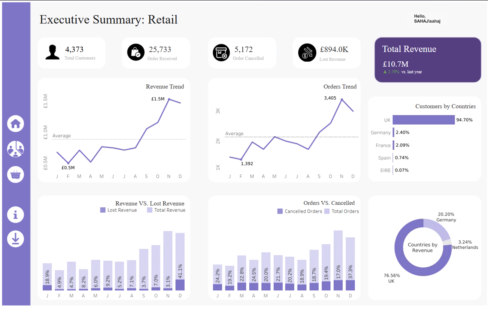
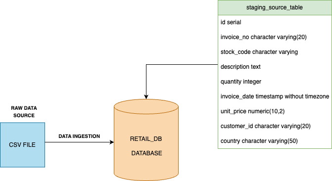
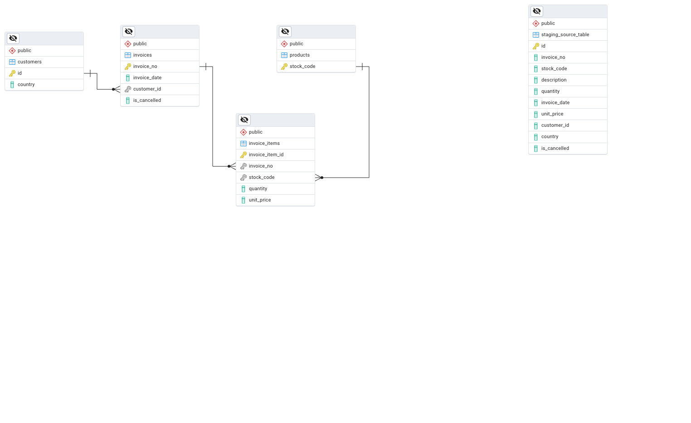
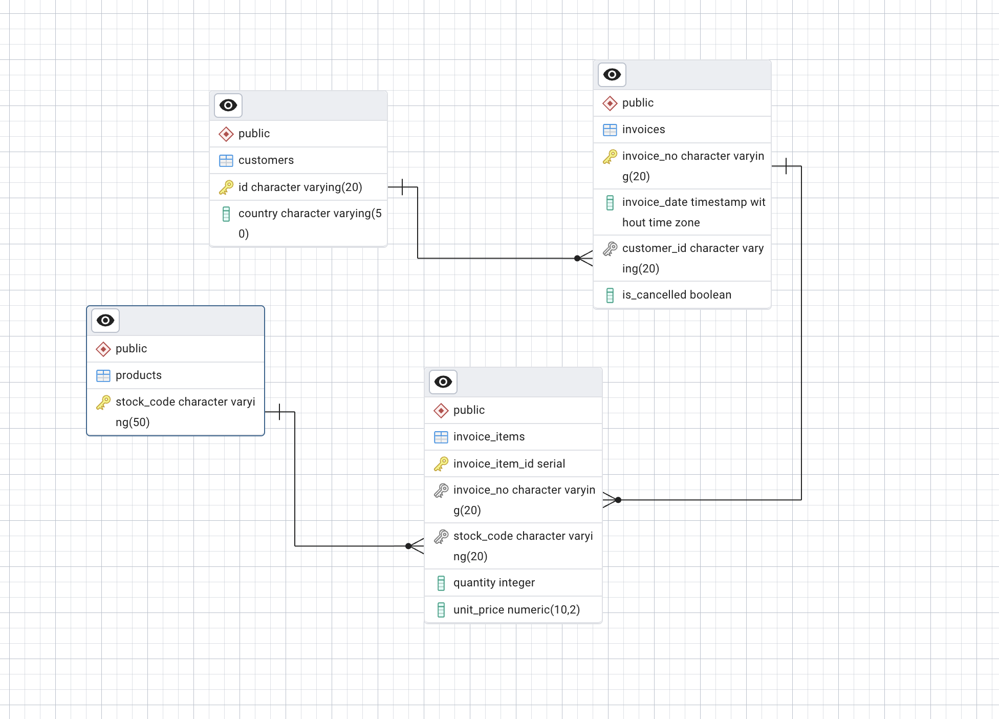

<div align="center">

# 🛒 RetailPulse

### E-Commerce Customer & Revenue Intelligence Platform

Turning **541,909 raw transaction rows** into a governed data model — and reading it back through three lenses (RFM segmentation, cohort retention, and market basket analysis) to diagnose churn, reveal buying patterns, and prescribe a path back to healthy growth.

[](sql/)
[](EDA/)
[](Analysis/)
[](Dashboard.png)
[](LICENSE)

[📄 Read the full Case Study](<RetailPulse - Case Study.pdf>) · [📊 View the Dashboard](Dashboard.png) · [🗄️ Explore the SQL](sql/) · [🧪 Explore the Analysis](Analysis/)

</div>

---

## 📖 Table of Contents

- [The Story](#-the-story)
- [The Business at a Glance](#-the-business-at-a-glance)
- [Executive Dashboard](#-executive-dashboard)
- [Architecture & Pipeline](#-architecture--pipeline)
- [Data Model](#-data-model)
- [Findings & Visual Story](#-findings--visual-story)
  - [Exploratory Findings](#exploratory-findings)
  - [Advanced Analytics](#advanced-analytics)
- [Strategic Playbook](#-strategic-playbook)
- [Tech Stack](#-tech-stack)
- [Repository Structure](#-repository-structure)
- [Getting Started](#-getting-started)
- [Deliverables](#-deliverables)
- [License](#-license)
- [Author](#-author)

---

## 🩺 The Story

A mid-sized UK online retailer — home decor, accessories, and personalised gifts, doing an estimated **£7–10M** in annual revenue — came in with a familiar symptom: healthy top-line numbers masking a customer base that was quietly churning.

**RetailPulse** is an end-to-end analytics teardown built to diagnose exactly that. Twelve months of invoice-level transactions (Dec 2010 – Dec 2011) were rebuilt from a single messy flat file into a governed, normalized data model, then read through three analytical lenses:

- **RFM Segmentation** — who are the customers actually worth protecting?
- **Cohort Retention Analysis** — *when*, not just *whether*, does churn happen?
- **Market Basket Analysis** — which products are quietly selling each other?

The result is a prioritised, numbers-backed action plan — not just a set of charts.

> 📄 The full narrative — written as a client-facing case study — is available in **[`RetailPulse - Case Study.pdf`](<RetailPulse - Case Study.pdf>)**. It's the best starting point if you want the story before the SQL.

---

## 📊 The Business at a Glance

| Metric | Value |
|---|---|
| Transactions analysed | **541,909** raw rows |
| Analysis window | Dec 2010 – Dec 2011 (1 year, 8 days) |
| Unique customers | **4,373** |
| Orders received | **25,733** |
| Orders cancelled | **5,172** (~20%) |
| Total revenue | **£10.7M** |
| Revenue lost to cancellations | **£894K** |
| Distinct SKUs sold | 4,052 |
| Countries served | 36 |
| Customers at risk of churn | **27.1%** (largest single RFM segment) |
| Month-12 retention (Dec 2010 cohort) | **26.6%** of the original cohort (73.4% churned) |

---

## 📈 Executive Dashboard

The full pipeline culminates in an interactive Tableau executive summary — the single-pane-of-glass view of the business.



*Revenue trend, order trend, cancellation-rate breakdown, and country-level contribution — all in one view. Total revenue of £10.7M, up 2.79% year-over-year, with the UK contributing 76.6% of revenue from 94.7% of the customer base.*

---

## 🏗️ Architecture & Pipeline

RetailPulse follows a five-stage pipeline, with every stage reproducible in SQL or Python so the process — not just the findings — can be handed off and re-run.

```
┌──────────────┐     ┌───────────────┐     ┌────────────────┐     ┌──────────────┐     ┌─────────────────┐
│  1. DATA     │ --> │ 2. PREPROCESS │ --> │ 3. NORMALIZE    │ --> │  4. EDA      │ --> │ 5. ADVANCED      │
│  MIGRATION   │     │ (Cleaning)    │     │ (Star Schema)   │     │ (Trends,     │     │ ANALYTICS        │
│              │     │               │     │                 │     │  Geography)  │     │ (RFM, Cohort,    │
│ CSV -> stage │     │ Nulls, dupes, │     │ Flat table ->   │     │              │     │  Basket)         │
│ table in     │     │ neg. qty,     │     │ 5-table         │     │ Order/rev    │     │                  │
│ Postgres     │     │ zero prices   │     │ relational      │     │ trends,      │     │ Segments,        │
│              │     │ resolved      │     │ model           │     │ cancel rates │     │ retention curves,│
│              │     │               │     │                 │     │              │     │ basket pairs     │
└──────────────┘     └───────────────┘     └────────────────┘     └──────────────┘     └─────────────────┘
     data/               sql/02_...            sql/03_...             EDA/                  Analysis/
                                                                                              sql/analytics.sql
```

**Ingestion at a glance:**



The raw `Online Retail.xlsx` file is converted to CSV and loaded into a single flat `staging_source_table` in PostgreSQL, which becomes the working surface for every cleaning and validation step that follows.

---

## 🗄️ Data Model

The flat staging table is decomposed into a governed, five-table relational schema — eliminating redundancy and enabling fast, reliable querying for every downstream analysis.

<table>
<tr>
<td width="50%">

**Conceptual relationships**



</td>
<td width="50%">

**Full ERD with column types**



</td>
</tr>
</table>

| Table | Grain | Purpose |
|---|---|---|
| `customers` | 1 row / customer | Deduplicated customer list with country |
| `products` | 1 row / stock code | Slim product key table |
| `product_details` | 1 row / (product, description, price) | Descriptive attributes, decoupled since a stock code can carry multiple description/price combinations over time |
| `invoices` | 1 row / invoice | Header-level record: date, customer, cancellation flag |
| `invoice_items` | 1 row / line item | Fact table bridging invoices ↔ products (quantity, unit price at time of sale) |

See **[`sql/README.md`](sql/)** for the exact DDL, build order, and the full cleaning log.

---

## 🔍 Findings & Visual Story

Every chart below is generated from the pipeline in this repo — SQL queries in [`sql/`](sql/) and [`EDA/insights.sql`](EDA/insights.sql), visualized in [`EDA/eda.ipynb`](EDA/eda.ipynb) and [`Analysis/analysis.ipynb`](Analysis/analysis.ipynb). Full narrative and methodology for each: [`EDA/README.md`](EDA/) and [`Analysis/README.md`](Analysis/).

### Exploratory Findings

<table>
<tr>
<td width="45%" valign="top">

</td>
<td width="55%" valign="top">

#### 🌍 A UK-anchored business with a valuable international tail

**90.3% of customers are UK-based** — the remaining 35 countries share the other 10%. But raw customer count hides where the real value sits: **Germany holds just 2.2% of customers while driving 19.2% of revenue.**

That's a small, high-spend segment easy to lose inside a generic "rest of world" bucket — and worth a dedicated retention play of its own rather than being treated as an afterthought.

📎 *[Full geography breakdown →](EDA/#1-customer-base--geography)*

</td>
</tr>
</table>

<table>
<tr>
<td width="55%" valign="top">

#### 📈 Orders climb into Q4 — right on cue for peak season

Order volume swings **145%** from the February trough (1,392 orders) to the November peak (3,405 orders) — a clean, seasonal signal tracking Black Friday and pre-holiday demand rather than random noise.

The March rebound (**+39%** over February) and the sustained Sep–Nov growth run (+34%, +12%, +31%) are the strongest stretches in the whole window — evidence that demand, not pricing, is what moves this business.

📎 *[Month-over-month order detail →](EDA/#3-order-volume--month-over-month-growth)*

</td>
<td width="45%" valign="top">

</td>
</tr>
</table>

<table>
<tr>
<td width="45%" valign="top">

</td>
<td width="55%" valign="top">

#### ⚠️ Cancellations track volume — until they don't

**20.58% of all orders were cancelled** across the year, with the rate ranging from a low of **17.27%** (November) to a high of **25.48%** (April).

The interesting part is the *mismatch*: November pairs the highest order volume of the year with one of the lowest cancellation rates — proof that higher volume didn't come at the cost of reliability that month. April, by contrast, underperforms on cancellations *despite* only moderate volume — a period-specific issue worth investigating directly rather than assuming it's just "more orders, more cancellations."

📎 *[Full cancellation analysis →](EDA/#4-cancellations)*

</td>
</tr>
</table>

<table>
<tr>
<td width="55%" valign="top">

#### 💷 Revenue mirrors orders — then December breaks the pattern

**Total revenue: £10.7M**, climbing from a £0.52M February low to a £1.52M November peak in near lock-step with order volume — the clearest indicator in the dataset that growth here is demand-led, not price-led.

**£894K was lost to cancellations** across the year — and it isn't spread evenly. December alone accounts for **41.1% of that month's revenue lost to cancellations**, nearly double any other month. This single number is the clearest, most actionable signal to come out of the exploratory pass.

📎 *[Revenue trend detail →](EDA/#5-revenue)*

</td>
<td width="45%" valign="top">

</td>
</tr>
</table>

### Advanced Analytics

<table>
<tr>
<td width="45%" valign="centre">

</td>
<td width="55%" valign="top">

#### 🧩 RFM turns 4,373 customers into five decisions

Scoring every customer on Recency, Frequency, and Monetary value collapses a flat customer list into five segments management can actually act on:

| Segment | Share |
|---|---|
| At Risk | **26.0%** |
| Less Frequent | 24.6% |
| Loyal | 20.8% |
| Dormant | 20.7% |
| Champions | 7.9% |

**At Risk is the single largest segment in the base**, and combined with Dormant, **47.6% of all customers** need active win-back attention. Only 7.9% are fully engaged Champions — small, but the group most worth protecting with VIP treatment over generic marketing spend.

📎 *[Full RFM methodology & read →](Analysis/#1-rfm-segmentation)*

</td>
</tr>
</table>

<table>
<tr>
<td width="55%" valign="top">

#### ⏳ The first two months decide the relationship

Grouping customers into monthly acquisition cohorts and tracking survival over time exposes *when* churn happens, not just that it happens.

The December 2010 cohort falls from **886 active customers at month 0 to just 236 by month 12** — a **73.4% cumulative churn rate** — with the steepest single drop landing in the very first month (886 → 325, a **63% fall**). A visible rebound at month 11 shows a seasonal promotion strong enough to temporarily reverse the curve — proof the trend is influenceable, not fixed.

**The takeaway:** retention campaigns aimed at month 3+ are already too late for most of the base.

📎 *[Full cohort methodology & read →](Analysis/#2-cohort-retention-analysis)*

</td>
<td width="45%" valign="centre">

</td>
</tr>
</table>

#### 🛍️ A handful of products are quietly selling each other

Market basket analysis over `invoice_items` surfaces stock code **`85099B`** appearing in **4 of the top 5** most frequently co-purchased pairs (833 co-occurrences with `22386` alone) — a single anchor product worth protecting on stock availability and featuring across every related product page. Sequentially-coded pairs (`22697`/`22698`/`22699`) further reveal customers buying entire product *collections*, not single SKUs — a direct signal for bundling and combo pricing.

📎 *[Full market basket read →](Analysis/#3-market-basket-analysis)*

---

## 🎯 Strategic Playbook

Three analyses converge into one prioritised, 90-day action plan:

| # | Action | Why | Effort |
|---|---|---|---|
| 1 | **Protect the top of the pyramid** | Champions + Loyal (28.9%) are cheaper to retain than replace | CRM / lifecycle — no new infra |
| 2 | **Win back the 47.6% At Risk / Dormant** | Abandoned-cart triggers, reactivation discounts, direct outreach | CRM / lifecycle |
| 3 | **Own the first 60 days** | Most cohorts lose over half their base in months 2–3 | Onboarding sequence design |
| 4 | **Bundle around `85099B` and its neighbours** | Top-10 pairs are already surfaced — ready to test today | Merchandising |
| 5 | **Fix the December leak** | £894K/year lost to cancellations — the single biggest recoverable number in this study | Policy |

**Success is tracked on three numbers:** cancellation rate (baseline ~20%, Dec spikes to 37.3%), At Risk + Dormant share (currently 47.6%), and month-2 cohort retention. Full roadmap and scorecard in the [case study](<RetailPulse - Case Study.pdf>).

---

## 🛠️ Tech Stack

| Layer | Tools |
|---|---|
| **Data storage & transformation** | PostgreSQL (staging → cleaning → 5-table relational schema) |
| **Analysis & scripting** | Python — `pandas`, `numpy`, `matplotlib`, `seaborn`, `psycopg2` |
| **Advanced analytics** | SQL window functions (`NTILE`, `LAG`) for RFM scoring, cohort matrices, and self-joins for basket-pair mining |
| **Visualization / BI** | Tableau (executive dashboard), Matplotlib/Seaborn (EDA & analysis notebooks) |
| **Source data** | [UCI Machine Learning Repository — Online Retail Dataset](https://archive.ics.uci.edu/dataset/352/online+retail) |

---

## 📁 Repository Structure

```
RetailPulse/
├── data/                          # Source data overview + Excel→CSV conversion script
│   ├── data_to_csv.py
│   └── README.md
├── sql/                           # The full SQL pipeline: load → clean → normalize → analyze
│   ├── 01_load_and_inspection.sql
│   ├── 02_transformation.sql
│   ├── 03_normalization.sql
│   ├── analytics.sql
│   └── README.md
├── EDA/                           # Exploratory data analysis (trends, geography, cancellations)
│   ├── eda.ipynb
│   ├── insights.sql
│   └── README.md
├── Analysis/                      # Advanced analytics: RFM segmentation & cohort retention
│   ├── analysis.ipynb
│   └── README.md
├── pngs/                          # All exported charts, diagrams & schema images
├── Dashboard.png                  # Tableau executive summary dashboard
├── RetailPulse - Case Study.pdf   # Full client-facing narrative case study
├── LICENSE
└── README.md                      # You are here
```

---

## 🚀 Getting Started

1. **Get the data** — download the source dataset and convert it to CSV. See **[`data/README.md`](data/)**.
2. **Build the database** — run the SQL pipeline in order against a PostgreSQL instance. See **[`sql/README.md`](sql/)**:
   - `01_load_and_inspection.sql` → load raw data & profile it
   - `02_transformation.sql` → clean it (duplicates, nulls, negative/zero prices)
   - `03_normalization.sql` → build the 5-table relational schema
   - `analytics.sql` → RFM, cohort, and market basket queries
3. **Explore the findings** — open the notebooks:
   - `EDA/eda.ipynb` for trend, geography, and cancellation analysis — see **[`EDA/README.md`](EDA/)**
   - `Analysis/analysis.ipynb` for RFM segmentation and cohort retention — see **[`Analysis/README.md`](Analysis/)**
4. **Read the story** — open **[`RetailPulse - Case Study.pdf`](<RetailPulse - Case Study.pdf>)** for the full narrative write-up, or view **[`Dashboard.png`](Dashboard.png)** for the executive summary.

> Each notebook connects to PostgreSQL via `psycopg2` — update the `db_params` dict at the top of each notebook with your own local credentials before running.

---

## 📦 Deliverables

| Deliverable | Description |
|---|---|
| [`RetailPulse - Case Study.pdf`](<RetailPulse - Case Study.pdf>) | Full 16-page client-facing case study: business context, methodology, findings, strategic playbook, and 90-day roadmap |
| [`Dashboard.png`](Dashboard.png) | Tableau executive summary — revenue, orders, cancellations, and geography at a glance |
| [`sql/`](sql/) | Complete, reproducible SQL pipeline from raw load through advanced analytics |
| [`EDA/eda.ipynb`](EDA/eda.ipynb) | Exploratory analysis notebook with inline commentary and charts |
| [`Analysis/analysis.ipynb`](Analysis/analysis.ipynb) | RFM segmentation and cohort retention analysis notebook |
| [`pngs/`](pngs/) | All exported visualizations and schema diagrams used throughout this repository |

---

## 📄 License

This project is licensed under the **MIT License** — see [`LICENSE`](LICENSE) for details.

The underlying dataset is the [UCI Online Retail Dataset](https://archive.ics.uci.edu/dataset/352/online+retail), used here for educational and portfolio purposes.

---

## 👤 Author

**Sahaj K.**

Built as a portfolio project demonstrating an end-to-end analytics workflow — from raw, messy data through a governed relational model to business-ready insight and a strategic recommendation deck.

</div>
